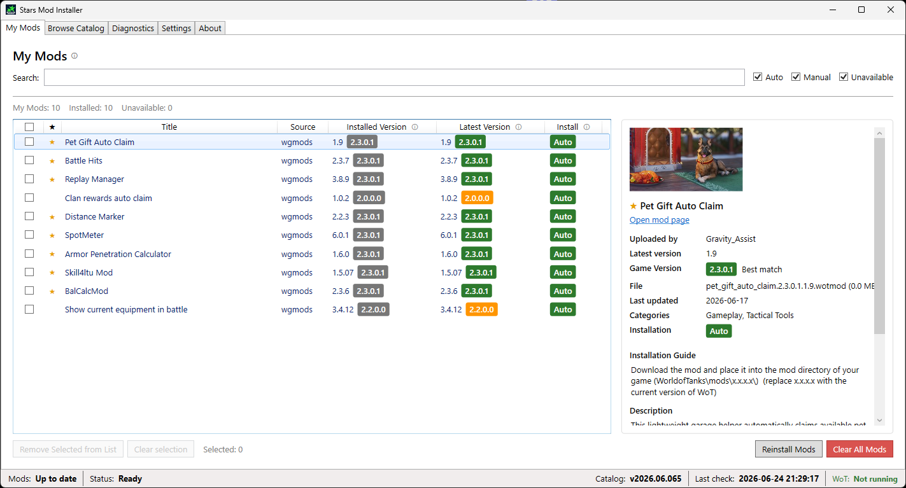
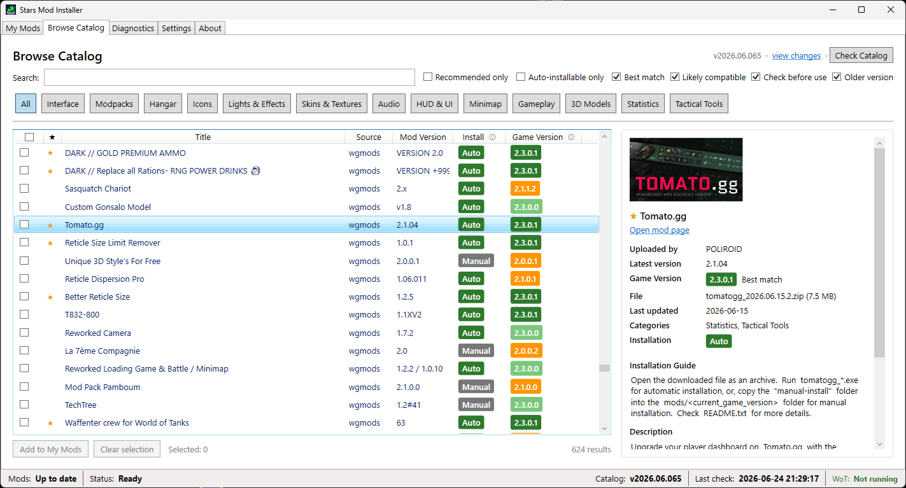
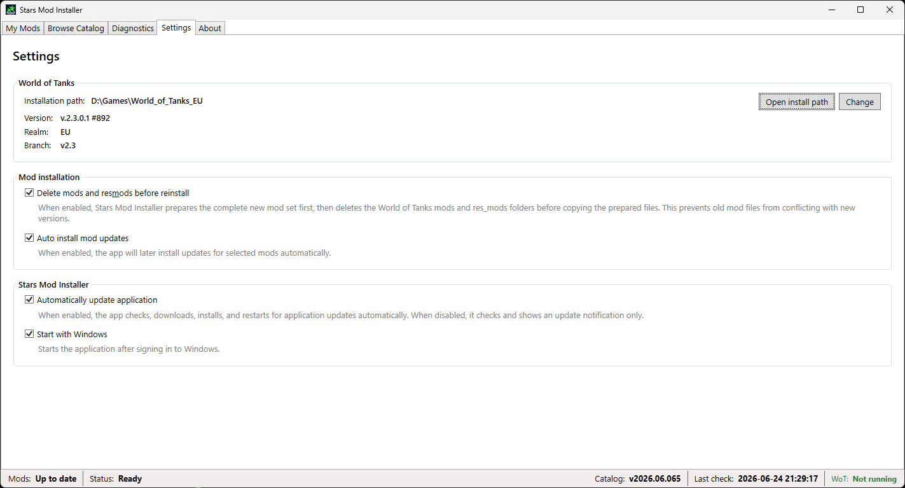

# Stars Mod Installer

Choose your World of Tanks mods once. Keep them updated automatically.

Stars Mod Installer keeps your selected mods up to date when a new mod version is released or when World of Tanks is updated.

No manual downloads. No copying files into game folders. No checking mod pages after every game update.

[Download for Windows](https://github.com/orik007/stars-mod-installer-hub/releases/latest/download/StarsModInstaller-win-Setup.exe)

[Join Discord](https://discord.gg/CyeFA8T4UP)

## Screenshots

## How it works

1. Install Stars Mod Installer.
2. Select the mods you want to use.
3. Let the installer keep them updated automatically.

When a compatible update is available, Stars Mod Installer downloads and installs it for you.

## Why use it

- Your selected mods stay up to date automatically
- Mods are updated after new mod releases or World of Tanks updates
- No need to manually download mod files
- No need to copy files into game folders
- The installer waits when World of Tanks is running

## Requirements

- Windows
- World of Tanks installed

## Note

Stars Mod Installer is an independent community tool and is not affiliated with Wargaming.
