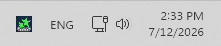

Stars Mod Installer keeps your selected mods **up to date** when a new mod version is released or when World of Tanks is updated.

**Set it up once. After that, the app starts automatically with Windows and runs quietly in the system tray. You do not need to launch a mod installer again after every game update.**

**System tray** — Stars Mod Installer stays running in the background and keeps compatible mods updated automatically.

The app lets you choose only from **official** World of Tanks mods available on [WGMods.net](https://wgmods.net).

No manual downloads. No rerunning a mod installer after every update. No copying files into game folders. **No checking mod pages after every game update**.

## Alpha version

Stars Mod Installer is currently in **alpha**. Some things may still change, and some mods may not be supported yet.

Found a bug or have an idea? Join us on [Discord](https://discord.gg/CyeFA8T4UP) and let us know.

## Screenshots

**My Mods** — see selected mods and their current install state.

**Browse Mods** — choose which mods you want Stars Mod Installer to keep updated.

**Settings** — control automatic updates and reinstall behavior.

## How it works

1. Install Stars Mod Installer.
2. Select the mods you want to use.
3. That’s it. Stars Mod Installer runs in the background and keeps compatible mods updated automatically.

When a compatible update is available, Stars Mod Installer downloads and installs it for you. If World of Tanks is running, it waits until the game is closed.

## Requirements

- Windows
- World of Tanks installed

## Note

Stars Mod Installer is an independent tool and is not affiliated with Wargaming.
